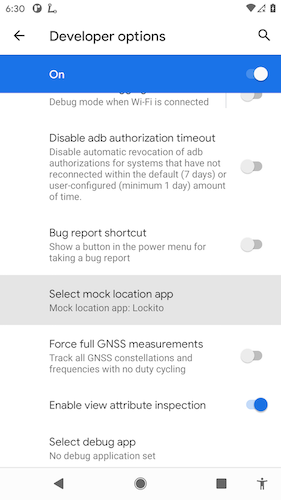

# android-codelab
Android project that serves as a base for code challenges implemented by applicants.
The base is written in kotlin. 

(!)If you have the NDK plugin installed, please disable it for the project, as errors may occur.

# Android Coding Challenges
Coding challenges are useful when the applicant does not provide a github repository or any work samples. Even if a github repository has been provided it is generally a good idea to give the applicant a task to solve and have him present his solution in a separate session. 

## General Instructions
The following instructions/conditions are valid independently of the actual coding challenge

- The code base has been tested with Android Studio Narwhal Feature Drop which is the recommended version, however feel free to try a higher version and adjust the configuration as needed
- The task should be implemented in kotlin
- Approach this task as if it was a real-world implementation - i.e. exactly how you would approach the task if you were working for a company
- 3rd party libraries may be used
- The base project for this task will be provided by us
- Once completed, please send us your solution and presents it to us, followed by a discussion about the implementation and design decisions made
- The solution can be sent as a zip file or as a publicly accessible github/gitlub etc project link
- The solution sent to us must be complete, i.e. can be opened directly via Android Studio without additional configuration

## Location Based Notifications
In this challenge the applicant has to implement location-based notifications/reminders, the following conditions are given:

- When creating a new memo, the user provides a location by selecting a point on a map (for instance: google maps or open street maps)
- The memo is then saved
- Once the user physically reaches that location, a notification should be displayed in the phone's status bar, that contains the title and the first 140 characters of the note text
- "Reaching the location" is defined as follows: The user is within 200 meters of the location he initially selected during the memo creation
- The notification should also contain an icon (the icon choice is up to you)
- The feature must also work, when the app is running in the background (or possibly not running at all)

# Implementation Details

## Architecture details
- Added Koin for a easier dependencies handling and a cleaner approach;
- Added a `domain` layer. `presentation` and `data` layers should depend on `domain`. `domain` should not depend on any of the app's layers;
- Further refactoring is possible for a better alignment with Clean Architecture principles. For demo purposes I have a few more public repositories that can be checked for other possible architectural solutions [Repo-1](https://github.com/ssand/ma-maison), [Repo-2](https://github.com/ssand/github-repos-demo);
- Updated the `data` layer to use data sources even though in this project those are just wrappers over the database DAO;
- For demo purposes I wrote only `CreateMemoViewModelTest` unit tests. All the rest are similar;
- In a real world scenario `android.permission.ACCESS_MOCK_LOCATION` permission should be moved to a separate `AndroidManifest.xml` available only in debug builds.

## Solution
Each time a new Memo with location details is created a new geofence is registered `GeofenceScheduler.registerMemoGeofence()`
When user enters Memo's area range a `MemoLocationBroadcastReceiver` is triggered which also fires a push notification.
`BootReceiver` is used to re-register active geofences after a device restart.

## Testing
To tests the implementation a physical device should be used. For this demo I used [Lokito app](https://play.google.com/store/apps/details?id=fr.dvilleneuve.lockito) to mock the device location. Lokito should be set as the `Mock location app` in Developer settings:

In the `assets/geofencing_demo.mov` there is a geofencing demo video using Lokito for location mocking:

1. Created a new Simulation in Lokito that "travels" virtually from point A to B;
2. Created 3 Memos along that path;
3. One memo that contains `completed` in it's title would be used to demonstrate that notifications are not triggered for completed Memos;
4. The app can be in the background or completely stopped;
5. Run the Simulation in Lokito;
6. As mocked coordinates are matching each Memo area a notification is triggered;
